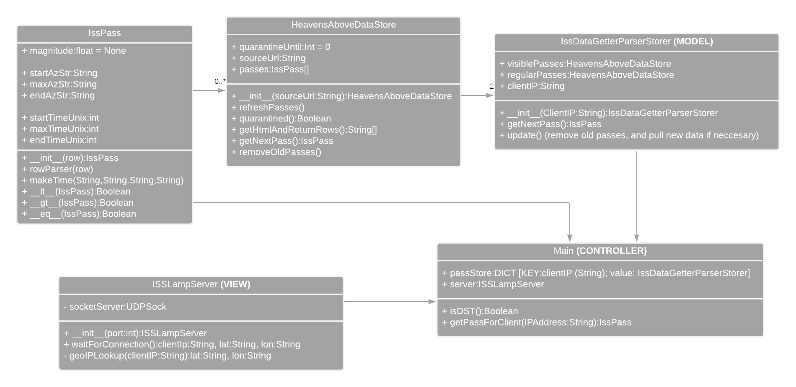

ISS_LAMP
========

Currently undergoing an extensive rewrite and restructuring, and also migrating to python3... This code was born ugly.. it's time to change that... I'm hoping to use this UMLish diagram a some sort of a roadmap:




My take on the ISS lamp, now based on an ESP8266. I did a writeup with nice pictures for [the hackaday challenge in 2014](http://hackaday.io/project/2026-iss-lamp-ntp-clock-artpiece)

The idea is to have a "stand-alone" unit which only needs power and wifi to work

The 'client' is an ESP8266 (nodemcuv2) which uses an NTP lookup and a UDP connection to get data about the International Space Station,
which is parsed (upon request) from heavens-above.com by the 'Server' side python script

Both visible and non-visible ("regular") passes are parsed:
Visible passes have priority. (visible passes are also listed in the "all passes" table, but this is accounted for)

The server side script is meant to be running in eg. a screen session on a linux machine.
Since heavens-above.com started to limit page hits per hour pr device, a caching version that spares the ressources of the site considerably has been implemented. This was my chance to clean up the python a bit, so it's actually much nicer now.

The IPv4 address of the server (and GMT offset for ntp time) is hardcoded into the arduino code. And easily changeable there.

The location (LATTITUDE, LONGTITUDE, TIMEZONE), that the ISS data lookups are based on, fetched from the [ipInfo API](https://github.com/ipinfo/python) ... but are sometimes hardcoded if i don't like the IPinfo i get about my home IP.

I use an old VFD display as my debug window on the arduino. It should be quite easy to change it to the serial interface, but beware the hardware.

This will always be a prototype, A work in progress, an ongoing thing. It is not, nor will it ever, be "done". The latest addition to the hardware is an http server listening for requests to dim the lights.

Some of the code in this project has been copied from all over the interwebs, i'm sorry, but i haven't kept track of my sources. If you feel wronged, drop me a line and i'll give credit where it's due.

I will however take full credit for the VFD code, which was written and libraryfied by me.

By take credit i mean that i wrote it, and hereby disclaim all ownership of it. feel free to use this code and edit, sell, buy, republish-taking-credit or print-out-and-eat it.

```bash
python3 -m pip install -r Server/requirements.txt
```

Happy hacking!
~Robotto
